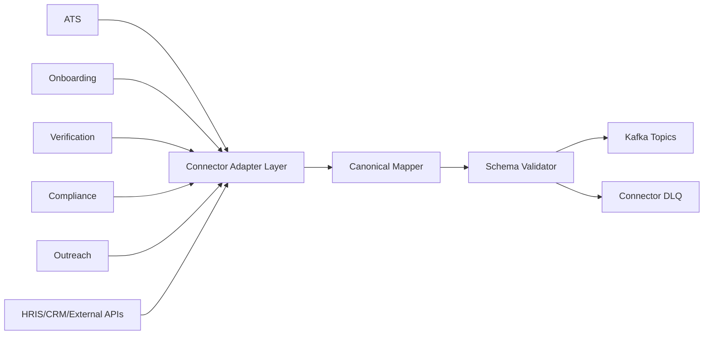

# LLD 01 - Source Connectors

## Purpose

Ingest operational changes from ATS, Outreach, Onboarding, Verification, Compliance, Browser Automation, Workflow Automation, Recollection, and external systems into canonical platform events.

## Responsibilities

- Capture product-domain changes (API/webhook/CDC)
- Convert records into canonical event envelope
- Attach tenant, entity, correlation, and version metadata
- Validate against schema registry before publish
- Publish to Kafka with idempotent producer settings

## Input -> Output

- Input: source events (DB changes, domain events, API callbacks)
- Output: canonical Kafka events (`tenant_id`, `entity_type`, `entity_id`, `event_type`, `event_time`, `payload`)

## Data flow

1. Source adapter receives or polls source-system update.
2. Mapping layer translates source format into canonical event.
3. Contract validator checks schema compatibility.
4. Producer writes to Kafka topic partitioned by `tenant_id + entity_id`.
5. On validation or publish failure, event goes to connector retry/DLQ path.

## Mermaid

## Failure handling

- Retry with exponential backoff for transient failures
- Route poison messages to connector DLQ
- Emit connector health metrics (success, retry, reject, lag)

