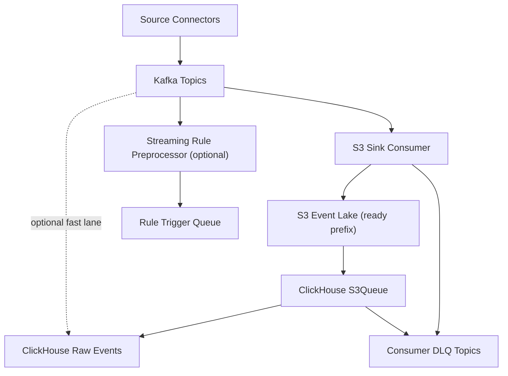

# LLD 02 - Event Backbone (Kafka/MSK)

## Purpose

Provide durable, ordered, replayable event transport between producers and downstream consumers.

## Responsibilities

- Topic management and partitioning
- Producer/consumer decoupling
- Replay window retention
- S3 anchoring for consistency-first processing
- DLQ routing for invalid or unprocessable messages

## Topic and partition design

- Topic convention: `ops.<domain>.<entity_events>`
- Partition key: `tenant_id + entity_id`
- Replication factor: 3 (critical topics)
- Retention: 7-14 days (long-term history in S3)

## Data flow

1. Source connectors publish canonical events.
2. Kafka stores ordered event log by partition.
3. Primary sink writes Kafka events to S3-ready prefixes.
4. ClickHouse consumes from S3 via S3Queue for raw table ingest.
5. Optional direct Kafka -> ClickHouse path can be enabled for low-latency endpoints.
6. Failed consumption is routed to consumer DLQ topics.

## Mermaid

## Operational controls

- Producer idempotence + `acks=all`
- Consumer lag alert thresholds by topic and tenant
- Dead-letter monitoring and replay tooling

## Configuration baseline (sub-60s target)

- Kafka -> S3 `rotate.interval.ms`: 10-15s
- target object size: 8-32 MB
- S3Queue polling: 1-2s
- S3Queue threads: 4-8 per shard
