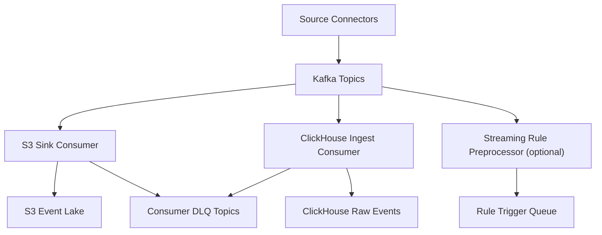

# LLD 02 - Event Backbone (Kafka/MSK)

## Purpose

Provide durable, ordered, replayable event transport between producers and downstream consumers.

## Responsibilities

- Topic management and partitioning
- Producer/consumer decoupling
- Replay window retention
- DLQ routing for invalid or unprocessable messages

## Topic and partition design

- Topic convention: `ops.<domain>.<entity_events>`
- Partition key: `tenant_id + entity_id`
- Replication factor: 3 (critical topics)
- Retention: 7-14 days (long-term history in S3)

## Data flow

1. Source connectors publish canonical events.
2. Kafka stores ordered event log by partition.
3. Parallel consumers read for:
   - S3 archival
   - ClickHouse raw ingest
   - optional real-time rule pre-check services
4. Failed consumption is routed to consumer DLQ topics.

## Mermaid

## Operational controls

- Producer idempotence + `acks=all`
- Consumer lag alert thresholds by topic and tenant
- Dead-letter monitoring and replay tooling

