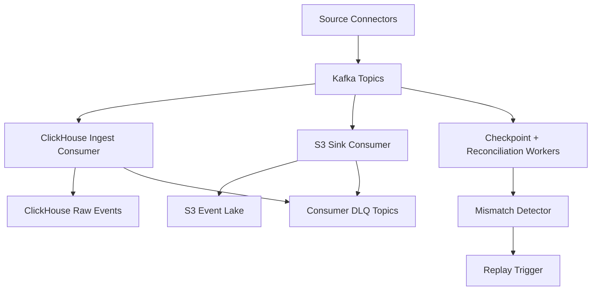

# LLD 02 - Event Backbone (Kafka/MSK)

## Purpose

Provide durable, ordered, replayable event transport between producers and downstream consumers.

## Responsibilities

- Topic management and partitioning
- Producer/consumer decoupling
- Fan-out to real-time serving and archival sinks
- DLQ routing for invalid or unprocessable messages
- Offset/checkpoint telemetry for ingestion control plane

## Topic and partition design

- Topic convention: `ops.<domain>.<entity_events>`
- Partition key: `tenant_id + entity_id`
- Replication factor: 3 (critical topics)
- Retention: 7-14 days (long-term history in S3)

## Data flow

1. Source connectors publish canonical events.
2. Kafka stores ordered event log by partition.
3. Parallel consumers read for:
   - ClickHouse raw ingest (real-time)
   - S3 archival sink
4. Reliability services consume offsets/metrics for checkpointing and reconciliation.
5. Failed consumption is routed to consumer DLQ topics.

## Mermaid

## Operational controls

- Producer idempotence + `acks=all`
- Consumer lag alert thresholds by topic and tenant
- Dead-letter monitoring and replay tooling
- Per-stage checkpoint updates every 5-15 seconds

## Configuration baseline (sub-60s target)

- Kafka partitions: 24-36 for high-volume domains
- CH consumers: match partition count over nodes/shards
- DLQ retry policy: exponential backoff + max retry cap
- Reconciliation cadence: every 5-15 minutes
