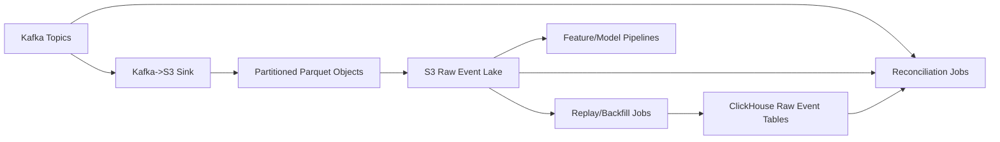

# LLD 03 - S3 Raw Event Lake

## Purpose

Store immutable historical event data for replay, audit, backfill, and AI/ML training.

## Responsibilities

- Persist Kafka stream into partitioned Parquet
- Retain long-term immutable history
- Support replay jobs into ClickHouse and downstream systems
- Provide audit export and lineage compatibility

## Storage layout

- Bucket: `s3://firstwork-events/`
- Partitioning: `tenant=<t>/year=<yyyy>/month=<mm>/day=<dd>/`
- File format: Parquet + compression
- Lifecycle: tier older partitions to colder storage classes

## Data flow

1. Kafka sink batches and writes events as Parquet objects.
2. Reconciliation jobs compare S3 counts/checksums with Kafka and ClickHouse.
3. Replay jobs read selected partitions by tenant/date.
4. Replay writes back into ClickHouse raw ingest pipeline.

## Mermaid

## Recovery behavior

- If ClickHouse ingestion fails, replay affected tenant/date range from S3
- Keep replay idempotent using `event_id` de-duplication logic downstream

## Cost-efficient write profile

- Sink roll interval: 30-120 seconds (tune by latency requirements)
- Object size target: 32-128 MB for balanced request cost and replay speed
- Keep partition prefixes bounded by tenant/time for efficient scans
