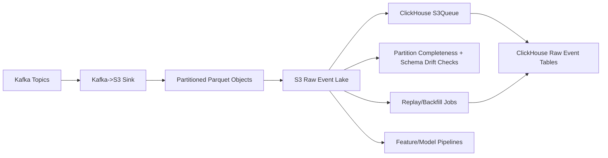

# LLD 03 - S3 Raw Event Lake

## Purpose

Store immutable historical event data for replay, audit, backfill, and AI/ML training.

## Responsibilities

- Persist Kafka stream into partitioned Parquet
- Expose `ready/` prefixes as ingestion source for ClickHouse S3Queue
- Retain long-term immutable history
- Support replay jobs into ClickHouse and downstream systems
- Provide audit export and lineage compatibility

## Storage layout

- Bucket: `s3://firstwork-events/`
- Partitioning: `tenant=<t>/year=<yyyy>/month=<mm>/day=<dd>/`
- File format: Parquet + compression
- Lifecycle: tier older partitions to colder storage classes

## Data flow

1. Kafka sink batches and writes events as Parquet objects into ready prefixes.
2. S3Queue discovers new ready files and streams them into ClickHouse raw tables.
3. Data quality checks verify partition completeness.
4. Replay jobs read selected partitions by tenant/date when repair is needed.

## Mermaid

## Recovery behavior

- If ClickHouse ingestion fails, replay affected tenant/date range from S3
- Keep replay idempotent using `event_id` de-duplication logic downstream

## Sub-60s write profile

- Sink roll interval: 10-15 seconds
- Object size target: 8-32 MB
- Publish only completed files into ready prefixes
- Keep file naming monotonic for ordered S3Queue processing
