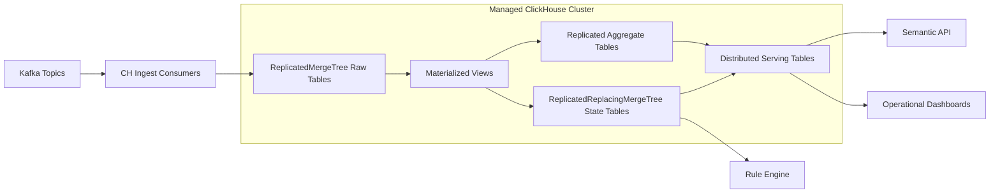

# LLD 04 - Managed ClickHouse Processing and Serving

## Purpose

Process raw events into operational state and serve low-latency analytical/operational queries.

## Responsibilities

- Consume Kafka events into raw replicated tables
- Build incremental state and aggregate projections
- Serve distributed query endpoints for semantic API and dashboards
- Handle late-arriving events using versioned state models

## Logical table layers

1. Raw (`worker_events_local`, `*_events_local`)
2. State (`worker_state_local`, `compliance_state_local`)
3. Aggregates (`daily_worker_metrics_local`, funnel metrics)
4. Distributed serving tables (`*_all`) over shards

## Engine and topology

- 2 shards x 2 replicas minimum
- Raw: `ReplicatedMergeTree`
- State: `ReplicatedReplacingMergeTree(state_version)`
- Aggregate: `ReplicatedSummingMergeTree` or `ReplicatedAggregatingMergeTree`
- Serving: `Distributed`

## Data flow

1. Kafka consumers write canonical events into raw local tables.
2. Materialized views project state and aggregate tables incrementally.
3. Semantic API reads distributed serving tables (`*_all`).
4. Rule engine reads state projections for action decisions.

## Mermaid

## Reliability

- Multi-AZ replicas
- Automated backups + restore drills
- Throttled replay from S3 for backfill safety

