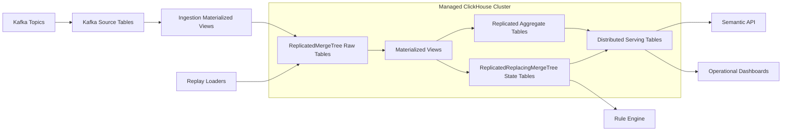

# LLD 04 - Managed ClickHouse Processing and Serving

## Purpose

Process raw events into operational state and serve low-latency analytical/operational queries.

## Responsibilities

- Consume Kafka events into raw replicated tables
- Build incremental state and aggregate projections
- Serve distributed query endpoints for semantic API and dashboards
- Handle late-arriving events using versioned state models
- Accept replay/backfill inserts from S3-driven repair services

## Logical table layers

1. Raw (`worker_events_local`, `*_events_local`)
2. State (`worker_state_local`, `compliance_state_local`)
3. Aggregates (`daily_worker_metrics_local`, funnel metrics)
4. Distributed serving tables (`*_all`) over shards

## Engine and topology

- 2 shards x 2 replicas minimum
- Raw: `ReplicatedMergeTree`
- State: `ReplicatedReplacingMergeTree(state_version)`
- Aggregate: `ReplicatedSummingMergeTree` or `ReplicatedAggregatingMergeTree`
- Serving: `Distributed`

## Data flow

1. Kafka source tables consume new event batches.
2. Ingestion MVs insert canonical events into raw local replicated tables.
3. Materialized views project state and aggregate tables incrementally.
4. Semantic API reads distributed serving tables (`*_all`).
5. Rule engine reads state projections for action decisions.
6. Replay loaders insert repaired windows into raw tables when triggered.

## Mermaid

## Reliability

- Multi-AZ replicas
- Automated backups + restore drills
- Throttled replay from S3/Kafka for backfill safety
- Idempotent inserts by `event_id`

## Kafka ingestion configuration baseline

- `kafka_num_consumers`: scale with partitions
- `kafka_thread_per_consumer = 1`
- `kafka_handle_error_mode = 'stream'`
- Store Kafka metadata (`_partition`, `_offset`, `_timestamp`) for debugging and reconciliation
