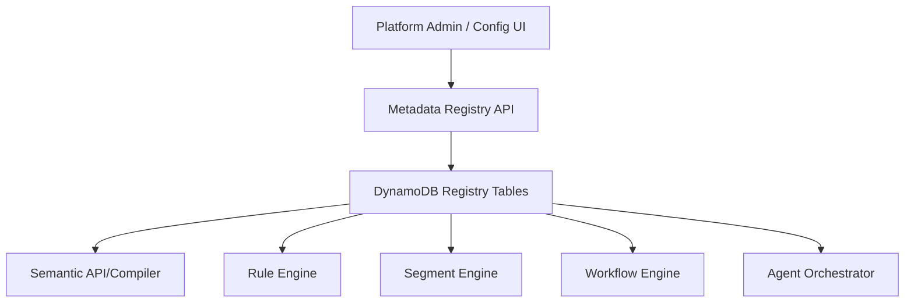

# LLD 05 - Metadata Registry (DynamoDB)

## Purpose

Centralize machine-readable definitions for entities, relationships, metrics, rules, segments, workflows, and agents.

## Responsibilities

- Versioned metadata storage
- Runtime lookups for semantic compiler, rule engine, and workflow engine
- Controlled publishing and rollback of metadata changes

## Core registries

- Entity registry
- Relationship registry
- Metric registry
- Rule registry
- Segment registry
- Workflow registry
- Agent registry

## Data flow

1. Platform admins publish metadata version updates.
2. Registry API persists definitions in DynamoDB.
3. Semantic API resolves fields/joins/metrics using registry definitions.
4. Rule and workflow engines execute using registry-backed definitions.

## Mermaid

## Consistency model

- Metadata reads are eventually consistent but version-pinned per request context
- Runtime services pass `metadata_version` for deterministic behavior

