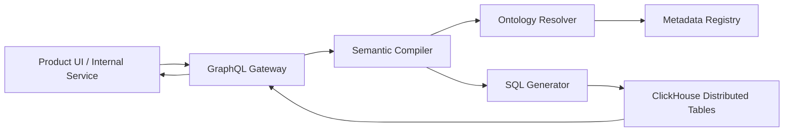

# LLD 06 - Semantic Query API (GraphQL + Compiler)

## Purpose

Expose ontology-driven operational query APIs without forcing consumers to understand physical ClickHouse schemas.

## Responsibilities

- GraphQL request parsing and validation
- Semantic AST compilation and ontology resolution
- SQL generation and execution against ClickHouse distributed tables
- Tenant access enforcement and query safety limits

## Request pipeline

1. Parse GraphQL query -> GraphQL AST
2. Compile -> Semantic AST
3. Resolve ontology fields/metrics with metadata registry
4. Generate SQL with tenant predicate enforcement
5. Execute query in ClickHouse
6. Return normalized API response

## Mermaid

## Query safety

- Mandatory tenant filters
- Query timeout and scan limits
- Denylist for unsupported high-cost patterns

## Connected systems

- Reads:
  - Metadata registry (definitions)
  - ClickHouse state/aggregate serving tables (data)
- Writes:
  - Access/query audit events into observability pipeline

