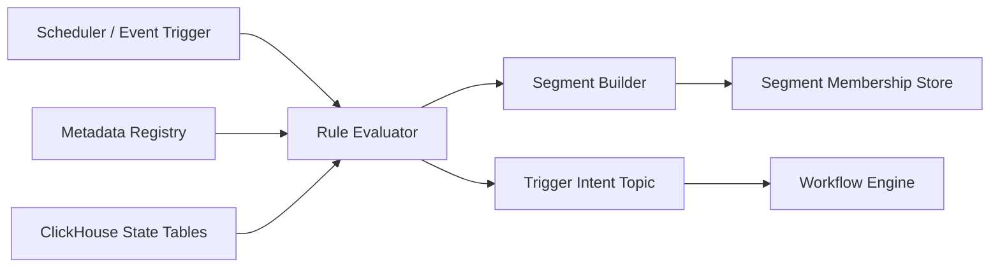

# LLD 07 - Rule and Segment Engine

## Purpose

Evaluate operational conditions from state projections and produce reusable segment memberships and trigger candidates.

## Responsibilities

- Execute rules from metadata registry
- Build and persist segment memberships
- Emit trigger intents for workflow orchestration

## Rule model

- Condition source: ClickHouse state tables
- Rule definition source: metadata registry
- Output:
  - rule evaluation result
  - segment membership updates
  - trigger event (`rule_triggered`)

## Data flow

1. Scheduler or event trigger starts evaluation.
2. Rule engine loads active rule definitions.
3. Engine queries ClickHouse state projections.
4. Segment engine computes memberships.
5. Trigger intents are published to workflow engine.

## Mermaid

## Connected outputs

- Workflow trigger intents
- Segment snapshots for campaign and outreach services
- Rule audit logs for governance

