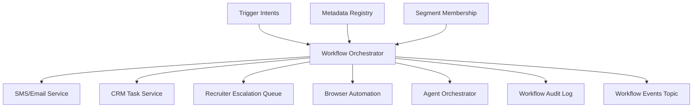

# LLD 08 - Workflow Orchestration Engine

## Purpose

Translate rule/segment triggers into deterministic operational actions across connected systems.

## Responsibilities

- Resolve workflow definitions and steps
- Enforce idempotency, retries, and compensations
- Dispatch actions to connectors (SMS, CRM task, escalation, browser automation)
- Emit workflow execution events

## Input -> Output

- Input:
  - trigger intents from rule engine
  - workflow definitions from metadata registry
- Output:
  - action commands
  - workflow execution status events

## Data flow

1. Trigger intent is consumed.
2. Workflow plan resolved from registry.
3. Guard conditions and dedupe checks run.
4. Actions dispatched to connected systems.
5. Execution result emitted as event for audit and analytics.

## Mermaid

## Execution safety

- Idempotency key: `tenant_id + workflow_id + entity_id + trigger_time_bucket`
- Retry policy with capped backoff
- Compensating action support for reversible failures

