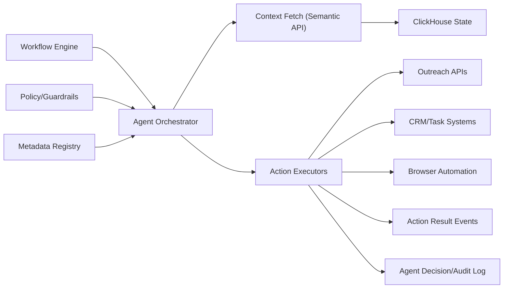

# LLD 09 - Agent Automation Layer

## Purpose

Execute policy-controlled autonomous or semi-autonomous actions using contextual operational state.

## Responsibilities

- Select agent strategy by trigger type
- Fetch context (worker state, compliance state, prior interactions)
- Execute bounded action plans
- Support human-in-the-loop approvals for high-impact actions
- Emit decision and action audit trails

## Action model

- Trigger source: workflow engine
- Context source: semantic API + metadata registry
- Side-effect systems: outreach APIs, CRM, browser automation, internal ticketing

## Data flow

1. Workflow engine sends agent task request.
2. Agent orchestrator resolves policy + capabilities.
3. Context service fetches required state and history.
4. Agent executes action steps and records outcomes.
5. Result events return to Kafka and audit store.

## Mermaid

## Safety controls

- Hard action allowlist by tenant and agent type
- Approval gates for irreversible actions
- Execution timeout and max-step limits

