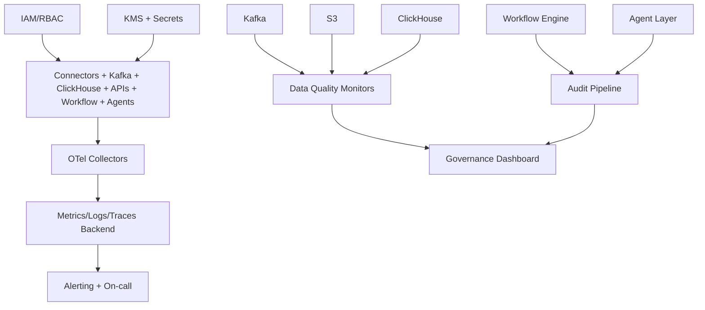

# LLD 10 - Observability, Security, and Governance

## Purpose

Provide cross-cutting controls for reliability, compliance, tenant isolation, and auditable operations.

## Responsibilities

- Unified telemetry (metrics, logs, traces)
- Alerting and SLO monitoring
- Authentication/authorization and key management
- Data quality checks and governance audits

## Control planes

- Observability:
  - OpenTelemetry collectors
  - CloudWatch dashboards and alert routes
- Security:
  - IAM roles, least privilege, service identities
  - KMS-backed encryption and secrets management
- Governance:
  - Schema drift checks
  - freshness and null-rate checks
  - action/audit event lineage

## Data flow

1. All platform services emit telemetry to OTel pipeline.
2. OTel exports to metrics/logging backend for alerts and dashboards.
3. Data quality jobs monitor Kafka, S3, and ClickHouse freshness/validity.
4. Audit pipeline ingests workflow and agent execution logs.

## Mermaid

## Minimum SLO guardrails

- Event ingestion availability: 99.9%+
- State freshness p95: under 60s
- Semantic API p95: under 1s (top operational queries)
- Workflow action success: 99%+

