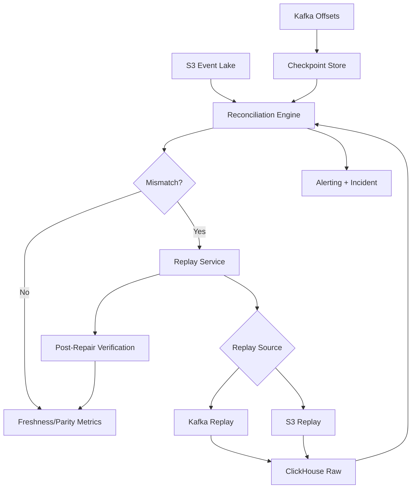

# LLD 11 - Ingestion Reliability Control Plane

## Purpose

Guarantee robust ingestion behavior for parallel sinks by coordinating idempotency, checkpointing, reconciliation, and replay.

## Responsibilities

- Track stage checkpoints (`Kafka->CH`, `Kafka->S3`, `Replay`)
- Classify and route failures to DLQ/quarantine
- Detect divergence across Kafka/S3/ClickHouse windows
- Trigger automated replay/repair workflows

## Inputs and outputs

- Inputs:
  - Kafka partition offsets
  - S3 partition/object counts and checksums
  - ClickHouse raw table counts/checksums
  - DLQ streams and error logs
- Outputs:
  - mismatch alerts
  - replay jobs
  - incident and audit records

## Data flow

1. Checkpoint workers collect offsets and watermark states.
2. Reconciliation jobs run on `(tenant_id, time_window)` buckets.
3. If mismatch exceeds threshold, replay service is triggered.
4. Replay loads missing windows from Kafka retention or S3 archive.
5. Post-replay verification closes the incident.

## Mermaid

## Control policies

- Idempotency key required: `event_id`
- Mismatch thresholds:
  - critical data sets: 0 tolerance
  - non-critical: bounded tolerance + delayed alert
- Retry policy:
  - transient: exponential backoff
  - deterministic bad payload: quarantine + manual remediation

## SLOs

- Reconciliation completion per active window: <= 15 min
- Replay trigger to repair completion: <= 30 min for standard windows
- Post-repair mismatch rate: 0 for critical entities
