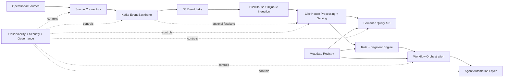

# Operational Intelligence Platform - LLD Suite

This directory contains low-level design documents for each major component in the platform.

## LLD components

1. `01-source-connectors-lld.md`
2. `02-event-backbone-kafka-lld.md`
3. `03-s3-event-lake-lld.md`
4. `04-clickhouse-processing-serving-lld.md`
5. `05-metadata-registry-lld.md`
6. `06-semantic-query-api-lld.md`
7. `07-rule-segment-engine-lld.md`
8. `08-workflow-orchestration-lld.md`
9. `09-agent-automation-lld.md`
10. `10-observability-security-governance-lld.md`

## End-to-end data flow map

