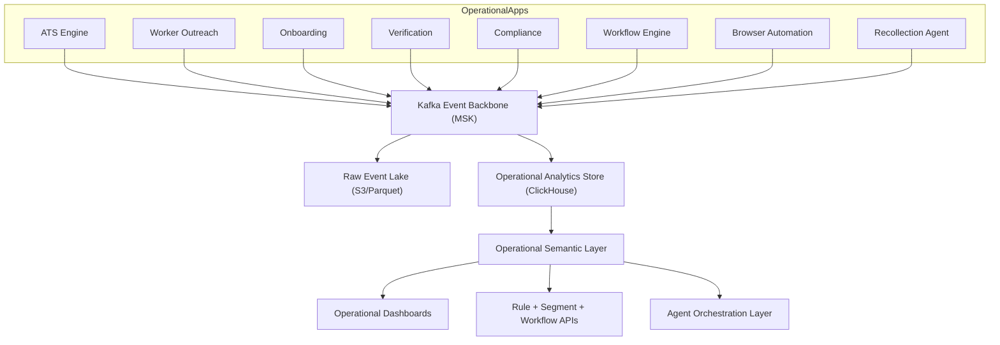

# Firstwork Operational Intelligence Platform

Author: Harsha Gudupudi  
Document type: System design and architecture specification  
Status: Draft v1

## 1) Objective

Build a shared Operational Intelligence Platform that sits across Firstwork products and provides:

- Unified operational visibility
- Cross-product analytics
- Workflow optimization
- Operational intelligence
- Agent-driven automation
- Future AI capabilities

This platform augments existing products and does not replace them.

## 2) Scope and non-goals

### In scope

- Event backbone across ATS, Outreach, Onboarding, Verification, Compliance, Workflow, Browser Automation, and Recollection
- Unified worker-centric state projections
- Operational ontology and semantic query layer
- Rule engine, segmentation, workflow trigger layer
- Agent action substrate

### Non-goals

- Replacing source product databases
- Building a generic BI warehouse as the primary goal
- Building autonomous agents before state quality and workflow safety controls are established

## 3) Workload summary

- Workload class: mixed operational analytics + event-driven automation
- Latency target:
  - Event ingestion to state projection: under 60 seconds p95
  - Query latency for operational APIs: under 1 second p95 for common workflows
- Data shape:
  - High-volume append-only event stream
  - Derived mutable business state
  - Multi-tenant access pattern
- Primary query patterns:
  - Worker state lookups by tenant/worker_id
  - Operational funnel and bottleneck analysis
  - Segment retrieval for automation and campaigns
- Operational constraints:
  - Replay/backfill required
  - Strict tenant isolation
  - Traceability for audit/compliance

## 4) Target architecture



## 5) Core architecture principles

1. **Event-sourced operational truth**  
   Operational products emit immutable domain events.

2. **State-first consumption**  
   Product and operations users query projected state tables, not raw event streams.

3. **Ontology-first semantics**  
   APIs and rules map to business entities (Worker, Job, Compliance, Document), not physical storage details.

4. **Replayability by design**  
   S3 Parquet lake is retained as historical source for backfills, audit, and ML.

5. **Actionability over passive analytics**  
   The platform exists to trigger interventions, workflow decisions, and agent actions.

## 6) Canonical event contract

All producers publish a normalized envelope:

```json
{
  "event_id": "uuid",
  "tenant_id": "acme",
  "event_type": "DocumentUploaded",
  "event_version": 1,
  "event_time": "2026-01-01T12:00:00Z",
  "producer": "onboarding-service",
  "entity_type": "Worker",
  "entity_id": "worker_123",
  "correlation_id": "trace_or_workflow_id",
  "payload": {}
}
```

Required controls:

- Schema registry with compatibility checks
- Contract testing per producer
- Dead-letter topics for invalid payloads

## 7) Data plane design

### 7.1 Event backbone (Kafka/MSK)

- Topic model:
  - `tenant.<tenant_id>.worker-events` (or hashed multi-tenant topics with tenant keying)
  - `ops.system-events`
- Partition key:
  - Default key: `tenant_id + entity_id` to preserve per-entity ordering
- Retention:
  - Sufficient to absorb downstream outages and replay windows (for example, 7-14 days)

### 7.2 Raw event lake (S3 Parquet)

- Path convention:
  - `s3://firstwork-events/tenant=<t>/year=<yyyy>/month=<mm>/day=<dd>/`
- Storage format:
  - Parquet + compression (snappy/zstd)
- Purpose:
  - Long-term retention, replay, backfills, model training, and audit

### 7.3 ClickHouse analytical and operational serving layer

Logical table categories:

1. Raw immutable event tables (`worker_events`, `document_events`)
2. State projections (`worker_state`, `compliance_state`, `document_state`)
3. Aggregates (`daily_worker_metrics`, `daily_compliance_metrics`)

Recommended modeling pattern:

- Keep raw events immutable in MergeTree tables
- Use materialized views for incremental projections/aggregates
- Use replacing/versioned state models for late-arriving and out-of-order updates

Representative example (illustrative):

```sql
CREATE TABLE worker_events (
  tenant_id LowCardinality(String),
  worker_id String,
  event_time DateTime64(3, 'UTC'),
  event_type LowCardinality(String),
  event_version UInt16,
  event_id UUID,
  payload_json String,
  ingest_time DateTime64(3, 'UTC') DEFAULT now64()
)
ENGINE = MergeTree
PARTITION BY toYYYYMM(event_time)
ORDER BY (tenant_id, worker_id, event_time, event_id);
```

```sql
CREATE TABLE worker_state (
  tenant_id LowCardinality(String),
  worker_id String,
  application_status LowCardinality(String),
  verification_status LowCardinality(String),
  compliance_status LowCardinality(String),
  readiness_score UInt8,
  state_version UInt64,
  updated_at DateTime64(3, 'UTC')
)
ENGINE = ReplacingMergeTree(state_version)
PARTITION BY toYYYYMM(updated_at)
ORDER BY (tenant_id, worker_id);
```

## 8) Ontology and semantic layer

Entity model:

- Worker
- Application
- Job
- Recruiter
- Document
- Credential
- Compliance
- Workflow
- Agent

The semantic layer compiles GraphQL into execution plans and ClickHouse SQL through:

1. GraphQL AST
2. Semantic AST
3. Ontology resolver
4. SQL generation
5. ClickHouse execution

The semantic layer enforces:

- Tenant scoping
- Field-level access rules
- Stable business definitions for metrics and statuses

## 9) Operational intelligence and automation loop

1. Ingest events from all operational apps
2. Project to state and metrics
3. Evaluate rules and segment membership
4. Trigger workflow actions
5. Escalate to agent actions where policy allows
6. Write resulting actions back as events for full traceability

## 10) Metadata platform (DynamoDB)

Metadata domains:

- Entity registry
- Relationship registry
- Metric registry
- Rule registry
- Segment registry
- Workflow registry
- Agent registry

Guidelines:

- Registry entries must be versioned and auditable
- Rule and segment definitions should be declarative and testable

## 11) Security and governance

- Tenant isolation:
  - `tenant_id` mandatory in event contracts and query filters
- Access control:
  - API authN/authZ via service identity + policy checks
- Data protection:
  - Encryption at rest (S3, Kafka, ClickHouse disks) and in transit (TLS)
- Compliance:
  - Immutable event lineage and action logs
- Data quality:
  - Event contract validation, null-rate checks, freshness SLAs

## 12) Reliability and operability

- Replay and backfill:
  - Backfill from S3 lake into ClickHouse raw and projection layers
- Failure isolation:
  - DLQ topics and idempotent consumers
- Observability:
  - End-to-end lag, projection freshness, workflow trigger success, agent action outcomes

## 13) Key architecture decisions with provenance

### Decision A: Kafka + S3 + ClickHouse as the operational data plane

- What: Use MSK for event transport, S3 for retention/replay, ClickHouse for serving state and aggregates.
- Why: Decouples producers from consumers and preserves replayable history.
- Category: derived
- Confidence: high
- Source:
  - https://clickhouse.com/docs/en/integrations/kafka
  - https://clickhouse.com/docs/best-practices
  - AWS MSK/S3 standard architecture guidance

### Decision B: State projections via incremental materialized views

- What: Build state and aggregate tables from immutable raw events.
- Why: Optimizes query latency while preserving historical truth.
- Category: official
- Confidence: high
- Source:
  - https://clickhouse.com/docs/materialized-view/incremental-materialized-view

### Decision C: Versioned upsert model for late-arriving events

- What: Use versioned state rows (for example, ReplacingMergeTree with `state_version`).
- Why: Handles out-of-order updates without high-cost mutations.
- Category: derived
- Confidence: medium
- Source:
  - https://clickhouse.com/docs/en/guides/replacing-merge-tree
  - https://clickhouse.com/docs/best-practices

## 14) Open decisions

1. ClickHouse deployment model:
   - ClickHouse Cloud vs self-managed ClickHouse on Kubernetes/VMs
2. Tenant sharding approach at higher scale:
   - Shared cluster with row-level isolation vs dedicated service per tenant tier
3. Rule execution runtime:
   - Stream-time evaluation vs micro-batch evaluator

## 15) Success criteria

- All operational products emit canonical events
- Worker state projection reaches target freshness SLO
- Rule/segment/workflow loop produces measurable reduction in stalled onboarding and compliance delays
- Agent actions are policy-gated, auditable, and reversible

