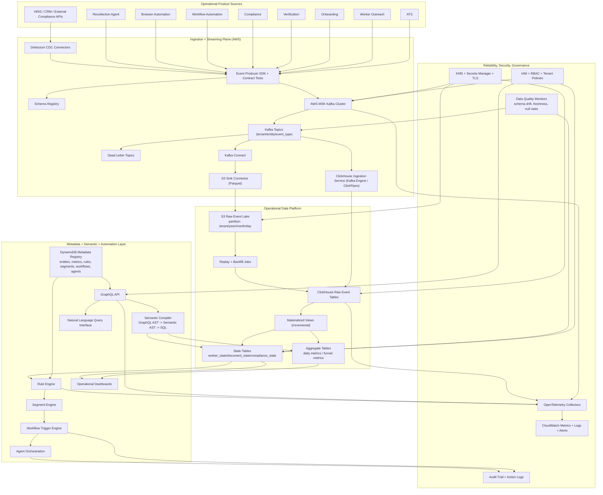

# Firstwork Operational Intelligence Platform
# Infrastructure + System Design Spec for 30-40 GB Ingestion

Status: Draft v1  
Scope: Production design target for 30-40 GB/day event ingestion  
Primary objective: Serve operational state and automation with replay-safe architecture

## 1) Capacity assumptions

To make sizing explicit, this spec assumes:

- **Ingestion volume:** 30-40 GB/day of raw events
- **Average event size:** ~1 KB (envelope + payload)
- **Daily event count:** ~30M-40M events/day
- **Average ingress rate:** ~350-470 KB/s
- **Peak factor:** 8x-12x (burst traffic from campaign and batch systems)
- **Peak ingress target:** up to ~4-6 MB/s sustained for burst windows
- **Multi-tenant:** all records scoped by `tenant_id`

If event size is larger, multiply partition and consumer capacity proportionally.

## 2) Complete infrastructure diagram (Mermaid)

## 3) System design specification for 30-40 GB/day

## 3.1 Kafka/MSK

- **Cluster layout:** 3 brokers minimum across 3 AZs
- **Replication factor:** 3 for critical topics
- **Min partitions:** 24-36 total across high-volume topics
- **Partition key:** `tenant_id + entity_id` (preserve per-entity ordering)
- **Retention:** 7-14 days in Kafka, long-term in S3
- **Safety settings:**
  - producer idempotence enabled
  - `acks=all`
  - consumer DLQ and retry with capped backoff

Why this works at 30-40 GB/day:

- Even with 10x burst, this remains moderate streaming load for MSK when partitioned and replicated correctly.

## 3.2 S3 event lake

- **Sink format:** Parquet (snappy/zstd)
- **Partitioning:** `tenant`, `year`, `month`, `day`
- **Object sizing target:** 128-512 MB files for efficient scan and replay
- **Retention:** multi-year per compliance policy
- **Lifecycle:** transition older partitions to colder storage classes

Estimated annual raw data:

- 40 GB/day -> ~14.6 TB/year raw before compression/lifecycle strategy

## 3.3 ClickHouse serving layer

- **Deployment:** ClickHouse Cloud preferred (or self-managed 2 shard x 2 replica baseline)
- **Data model layers:**
  1. raw immutable event tables
  2. state projection tables
  3. aggregate metrics tables
- **Engine strategy:**
  - Raw: `MergeTree`
  - State: `ReplacingMergeTree(version)` for late-arriving updates
  - Aggregates: incremental materialized views to precompute operational KPIs
- **Partitioning baseline:** monthly by event time (`toYYYYMM(event_time)`)
- **ORDER BY baseline:** `(tenant_id, entity_id, event_time, event_id)`

Capacity baseline:

- 90-day hot window at 40 GB/day raw = 3.6 TB raw input
- Compression and columnar storage typically reduce footprint materially; account for replication overhead in total capacity planning

## 3.4 Semantic and query serving

- GraphQL over ontology (Worker/Application/Document/Compliance/Workflow/Agent)
- Semantic compiler to SQL with mandatory tenant predicate pushdown
- Query guardrails:
  - per-query timeout
  - row scan limits
  - cost-based rejection for pathological queries

## 3.5 Rule, segment, and workflow activation

- Rule engine evaluates state projection tables (not raw event scans)
- Segment engine composes reusable rule outputs
- Workflow engine executes idempotent actions and emits action events back into Kafka
- Agent execution behind policy and approval gates

## 4) Latency and reliability targets

- Ingestion to ClickHouse raw availability: p95 under 20s
- Ingestion to state projection: p95 under 60s
- Semantic API p95 for common worker queries: under 1s
- Workflow trigger success: 99%+
- Replay SLA: tenant/day replay initiated under 15 minutes

## 5) Security and governance requirements

- Enforce tenant isolation in all event and query paths
- Encrypt all storage and transport (TLS + KMS-backed encryption at rest)
- RBAC for APIs and infrastructure operations
- Immutable audit logs for rule decisions and agent actions
- Data quality checks:
  - schema drift
  - freshness lag
  - event null/invalid rates

## 6) Deployment blueprint by environment

- **dev:** functional integration and contract tests
- **stage:** scale/perf test at 30-40 GB/day equivalent replay load
- **prod:** gradual tenant onboarding, canary by source system

Promotion gates:

1. Event contract compatibility checks pass
2. Projection freshness and query SLO pass in stage
3. Rule action idempotency and rollback tests pass
4. Security and audit controls verified

## 7) Minimal MVP build order for this scale

1. Canonical event schema + schema registry + producer SDK
2. MSK topics + DLQ + S3 sink
3. ClickHouse raw + `worker_state` projection + daily aggregates
4. GraphQL semantic API for worker/compliance operational queries
5. First rule pack:
   - workers stuck > 48h
   - expiring credential in 30 days
6. Workflow trigger + audited action logging

This is sufficient to deliver operational intelligence and automation for 30-40 GB/day while preserving replayability and future AI readiness.

