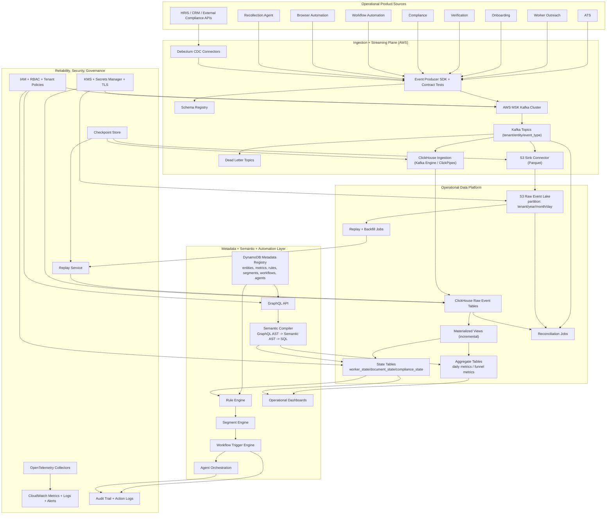
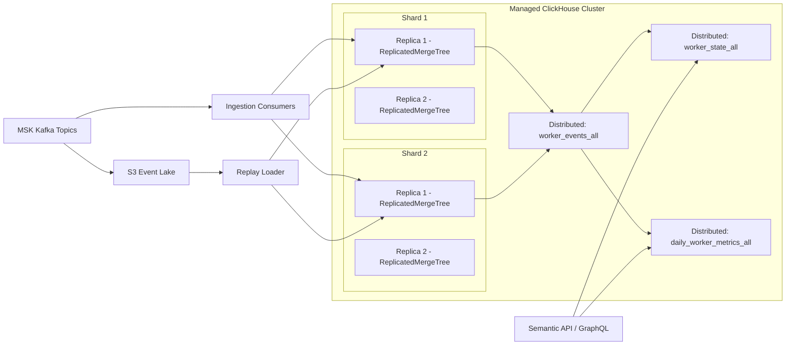

# Firstwork Operational Intelligence Platform
# Infrastructure + System Design Spec for 30-40 GB Ingestion

Status: Draft v2  
Scope: Production design target for 30-40 GB/day event ingestion  
Primary objective: Serve operational state and automation with replay-safe architecture

## 1) Capacity assumptions

To make sizing explicit, this spec assumes:

- **Ingestion volume:** 30-40 GB/day of raw events
- **Average event size:** ~1 KB (envelope + payload)
- **Daily event count:** ~30M-40M events/day
- **Average ingress rate:** ~350-470 KB/s
- **Peak factor:** 8x-12x (burst traffic from campaign and batch systems)
- **Peak ingress target:** up to ~4-6 MB/s sustained for burst windows
- **Multi-tenant:** all records scoped by `tenant_id`

If event size is larger, multiply partition and consumer capacity proportionally.

## 2) Complete infrastructure diagram (Mermaid)



## 3) System design specification for 30-40 GB/day

## 3.0 Ingestion strategy decision

Primary production path (recommended):

`Sources -> Kafka -> (parallel) ClickHouse + S3`

Reliability control plane (required):

- immutable `event_id`
- checkpoint tracking per stage
- DLQ and quarantine
- reconciliation and replay automation

Alternative compliance path (optional):

`Sources -> Kafka -> S3 -> ClickHouse`

Use parallel mode when operational latency matters; enforce correctness with reconciliation and replay.

## 3.1 Kafka/MSK

- **Cluster layout:** 3 brokers minimum across 3 AZs
- **Replication factor:** 3 for critical topics
- **Min partitions:** 24-36 total across high-volume topics
- **Partition key:** `tenant_id + entity_id` (preserve per-entity ordering)
- **Retention:** 7-14 days in Kafka, long-term in S3
- **Safety settings:**
  - producer idempotence enabled
  - `acks=all`
  - consumer DLQ and retry with capped backoff

Why this works at 30-40 GB/day:

- Even with 10x burst, this remains moderate streaming load for MSK when partitioned and replicated correctly.

## 3.2 S3 event lake

- **Sink format:** Parquet (snappy/zstd)
- **Partitioning:** `tenant`, `year`, `month`, `day`
- **Object sizing target:** 32-128 MB files for efficient request economics
- **Retention:** multi-year per compliance policy
- **Lifecycle:** transition older partitions to colder storage classes

Kafka -> S3 sink baseline:

- `rotate.interval.ms`: 30000-120000
- `flush.size`: tuned to avoid tiny files under low throughput
- monotonic partition prefixes for efficient replay scans

Estimated annual raw data:

- 40 GB/day -> ~14.6 TB/year raw before compression/lifecycle strategy

## 3.3 ClickHouse serving layer

- **Deployment:** Managed ClickHouse preferred (or self-managed 2 shard x 2 replica baseline)
- **Data model layers:**
  1. raw immutable event tables
  2. state projection tables
  3. aggregate metrics tables
- **Engine strategy:**
  - Raw: `ReplicatedMergeTree`
  - State: `ReplicatedReplacingMergeTree(version)` for late-arriving updates
  - Aggregates: incremental materialized views to precompute operational KPIs
- **Ingestion path:** Kafka engine/ClickPipes into replicated raw tables
- **Partitioning baseline:** monthly by event time (`toYYYYMM(event_time)`)
- **ORDER BY baseline:** `(tenant_id, entity_id, event_time, event_id)`

Capacity baseline:

- 90-day hot window at 40 GB/day raw = 3.6 TB raw input
- Compression and columnar storage typically reduce footprint materially; account for replication overhead in total capacity planning

## 3.4 Semantic and query serving

- GraphQL over ontology (Worker/Application/Document/Compliance/Workflow/Agent)
- Semantic compiler to SQL with mandatory tenant predicate pushdown
- Query guardrails:
  - per-query timeout
  - row scan limits
  - cost-based rejection for pathological queries

## 3.5 Rule, segment, and workflow activation

- Rule engine evaluates state projection tables (not raw event scans)
- Segment engine composes reusable rule outputs
- Workflow engine executes idempotent actions and emits action events back into Kafka
- Agent execution behind policy and approval gates

## 4) Latency and reliability targets

- Ingestion to ClickHouse raw availability (parallel path): p95 under 20s
- Ingestion to state projection: p95 under 60s
- Semantic API p95 for common worker queries: under 1s
- Workflow trigger success: 99%+
- Replay SLA: tenant/day replay initiated under 15 minutes

## 5) Security and governance requirements

- Enforce tenant isolation in all event and query paths
- Encrypt all storage and transport (TLS + KMS-backed encryption at rest)
- RBAC for APIs and infrastructure operations
- Immutable audit logs for rule decisions and agent actions
- Data quality checks:
  - schema drift
  - freshness lag
  - event null/invalid rates

## 6) Deployment blueprint by environment

- **dev:** functional integration and contract tests
- **stage:** scale/perf test at 30-40 GB/day equivalent replay load
- **prod:** gradual tenant onboarding, canary by source system

Promotion gates:

1. Event contract compatibility checks pass
2. Projection freshness and query SLO pass in stage
3. Reconciliation and replay tests pass
4. Rule action idempotency and rollback tests pass
5. Security and audit controls verified

## 7) Minimal MVP build order for this scale

1. Canonical event schema + schema registry + producer SDK
2. MSK topics + DLQ + dual sinks (S3 and ClickHouse)
3. Implement checkpoints + reconciliation + replay services
4. ClickHouse `worker_state` projection + daily aggregates
5. GraphQL semantic API for worker/compliance operational queries
6. First rule pack:
   - workers stuck > 48h
   - expiring credential in 30 days
7. Workflow trigger + audited action logging

This is sufficient to deliver operational intelligence and automation for 30-40 GB/day while preserving replayability and robust failure recovery.

## 8) Managed ClickHouse processing + serving design (replicated MergeTree)

This section defines the managed ClickHouse topology for both ingestion processing and low-latency serving.

### 8.1 Cluster topology

- Managed ClickHouse cluster
- **2 shards x 2 replicas** minimum for production baseline
- Dedicated role separation:
  - **processing path:** Kafka ingestion + materialized view compute
  - **serving path:** GraphQL/semantic API reads from distributed serving tables



### 8.2 Table engine strategy

- Local raw tables: `ReplicatedMergeTree`
- Local state tables: `ReplicatedReplacingMergeTree(version)`
- Local aggregates: `ReplicatedSummingMergeTree` or `ReplicatedAggregatingMergeTree` based on metric type
- Serving tables: `Distributed` across all shards

Why:

- Replication provides HA and read availability during node failures.
- MergeTree family gives efficient compression and time-range scans.
- Distributed tables give a single logical endpoint for APIs and dashboards.

### 8.3 Reference DDL pattern

```sql
-- Kafka source table
CREATE TABLE worker_events_kafka ON CLUSTER firstwork_cluster
(
  tenant_id String,
  worker_id String,
  event_time DateTime64(3, 'UTC'),
  event_type String,
  event_id UUID,
  event_version UInt16,
  payload_json String
)
ENGINE = Kafka(
  'kafka-broker:9092',
  'worker-events',
  'ch-worker-events-group',
  'JSONEachRow'
)
SETTINGS
  kafka_num_consumers = 4,
  kafka_thread_per_consumer = 1,
  kafka_handle_error_mode = 'stream';

-- Local raw events (on each replica)
CREATE TABLE worker_events_local ON CLUSTER firstwork_cluster
(
  tenant_id LowCardinality(String),
  worker_id String,
  event_time DateTime64(3, 'UTC'),
  event_type LowCardinality(String),
  event_id UUID,
  event_version UInt16,
  payload_json String,
  ingest_time DateTime64(3, 'UTC') DEFAULT now64()
)
ENGINE = ReplicatedMergeTree(
  '/clickhouse/tables/{shard}/worker_events_local',
  '{replica}'
)
PARTITION BY toYYYYMM(event_time)
ORDER BY (tenant_id, worker_id, event_time, event_id);

-- MV from Kafka to local raw events
CREATE MATERIALIZED VIEW worker_events_kafka_mv ON CLUSTER firstwork_cluster
TO worker_events_local
AS
SELECT
  tenant_id,
  worker_id,
  event_time,
  event_type,
  event_id,
  event_version,
  payload_json,
  now64() AS ingest_time
FROM worker_events_kafka;

-- Global serving table across shards
CREATE TABLE worker_events_all ON CLUSTER firstwork_cluster AS worker_events_local
ENGINE = Distributed(
  firstwork_cluster,
  default,
  worker_events_local,
  cityHash64(tenant_id, worker_id)
);

-- Local state projection table (late-event safe)
CREATE TABLE worker_state_local ON CLUSTER firstwork_cluster
(
  tenant_id LowCardinality(String),
  worker_id String,
  application_status LowCardinality(String),
  verification_status LowCardinality(String),
  compliance_status LowCardinality(String),
  readiness_score UInt8,
  state_version UInt64,
  updated_at DateTime64(3, 'UTC')
)
ENGINE = ReplicatedReplacingMergeTree(
  '/clickhouse/tables/{shard}/worker_state_local',
  '{replica}',
  state_version
)
PARTITION BY toYYYYMM(updated_at)
ORDER BY (tenant_id, worker_id);

CREATE TABLE worker_state_all ON CLUSTER firstwork_cluster AS worker_state_local
ENGINE = Distributed(
  firstwork_cluster,
  default,
  worker_state_local,
  cityHash64(tenant_id, worker_id)
);
```

### 8.4 Managed operations requirements

- Multi-AZ replicas enabled
- Automated backups + tested restore
- Rolling upgrade policy with canary replica
- Per-role users:
  - `ingest_writer` (INSERT only on local ingest tables)
  - `semantic_reader` (SELECT on distributed serving tables)
  - `ops_admin` (restricted operational privileges)

### 8.5 ClickHouse best-practice alignment

- Per `schema-pk-plan-before-creation`: choose ORDER BY keys before launch.
- Per `schema-pk-cardinality-order`: keep ORDER BY low -> high cardinality.
- Per `schema-partition-low-cardinality` and `schema-partition-lifecycle`: use monthly partitions for lifecycle, not ad-hoc query acceleration.
- Per `insert-mutation-avoid-update`: use replacing/versioned state patterns instead of frequent UPDATE mutations.
- Per `query-mv-incremental`: build real-time aggregates through incremental materialized views.

## 8.6 Parallel-path reliability profile

Use this baseline profile to keep ingestion robust and state freshness under 60 seconds p95:

- Producer: idempotent + `acks=all`
- Kafka consumer parallelism: match topic partitions
- Checkpoint commit interval: 5-15s
- Reconciliation interval: 5-15m per tenant/time bucket
- Replay trigger on mismatch thresholds
- Keep ingest MVs lightweight (avoid heavy joins in ingest path)

Latency budget guideline:

- Kafka consume + parse: 2-8s
- raw insert: 2-10s
- raw -> state MV update: 5-15s
- total p95 target: 15-45s

Must-have monitors:

- Kafka consumer lag per partition
- ingest-to-raw lag and ingest-to-state lag
- DLQ rate by error class
- reconciliation mismatch rate
- duplicate `event_id` rate
